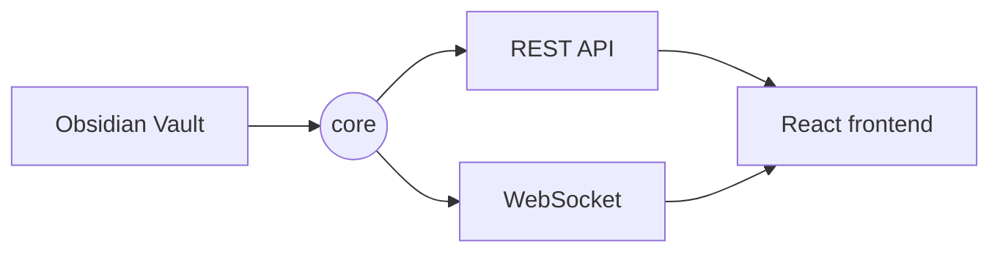

# Welcome to Obsidian Web

This is a demo vault. It shows what the platform renders out of the box.

## Wiki links

- Plain link: [[Projects/Platform Roadmap]]
- Link with alias: [[Ideas/Reading List|My reading list]]
- Link to a heading: [[Projects/Platform Roadmap#Milestones]]
- A link to a missing note: [[Not Written Yet]]

## Callouts

> [!note] A note callout
> Callouts work just like in Obsidian.

> [!warning]
> This one has no custom title.

> [!tip] Pro tip
> Press **⌘K** to search the vault.

## Tasks

- [x] Install Obsidian Web
- [x] Open the demo vault
- [ ] Point it to your real vault

## Table

| Module     | Language   | Status |
| ---------- | ---------- | ------ |
| core       | Go         | ✅     |
| web        | TypeScript | ✅     |
| plugin-sdk | Go         | ✅     |

## Mermaid



## Math

Inline math: $e^{i\pi} + 1 = 0$

$$
\int_{-\infty}^{\infty} e^{-x^2} \, dx = \sqrt{\pi}
$$

## Code

```go
func main() {
    fmt.Println("The vault is the single source of truth")
}
```

Tags also work inline: #getting-started #demo
